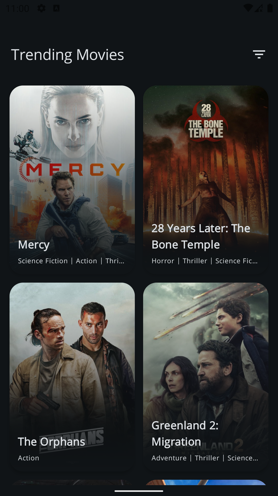
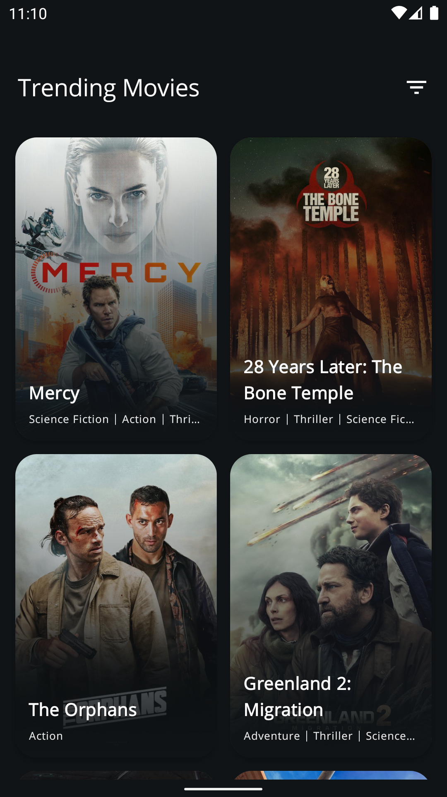
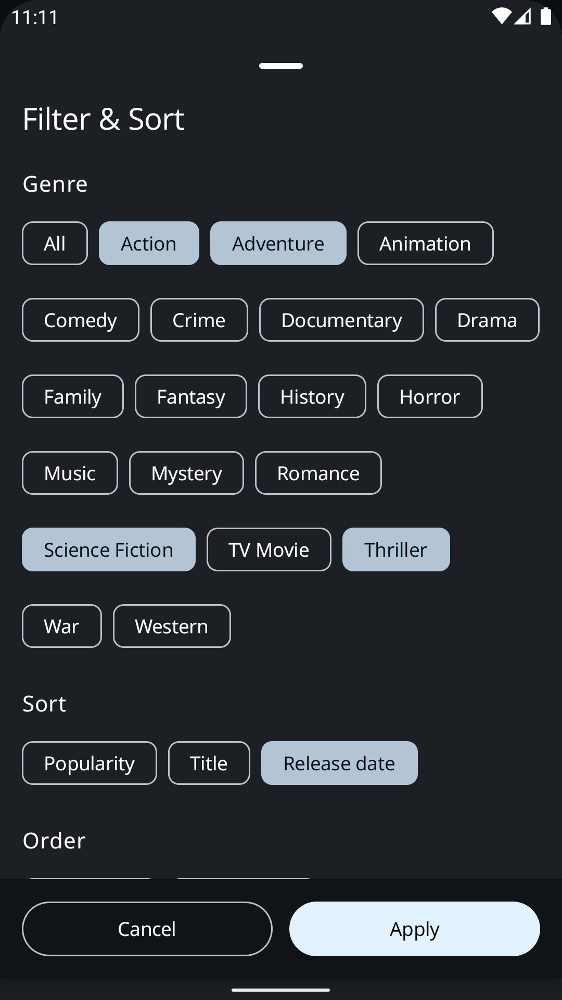
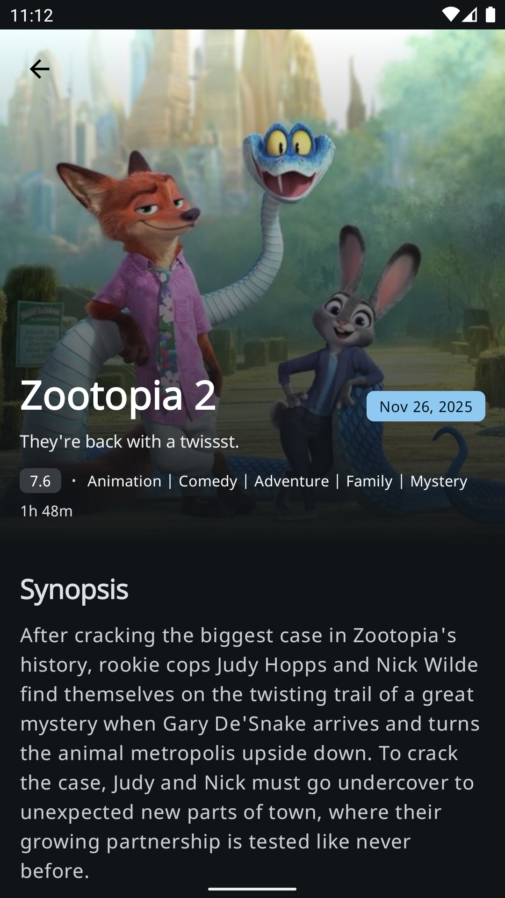
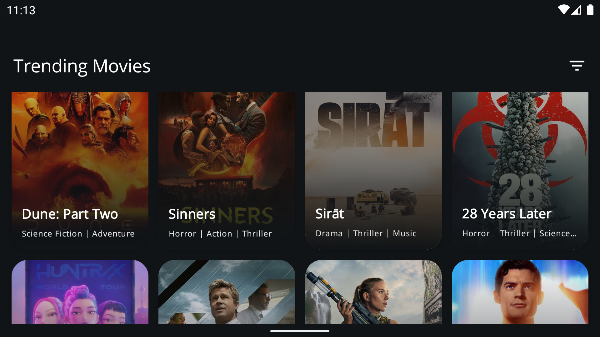
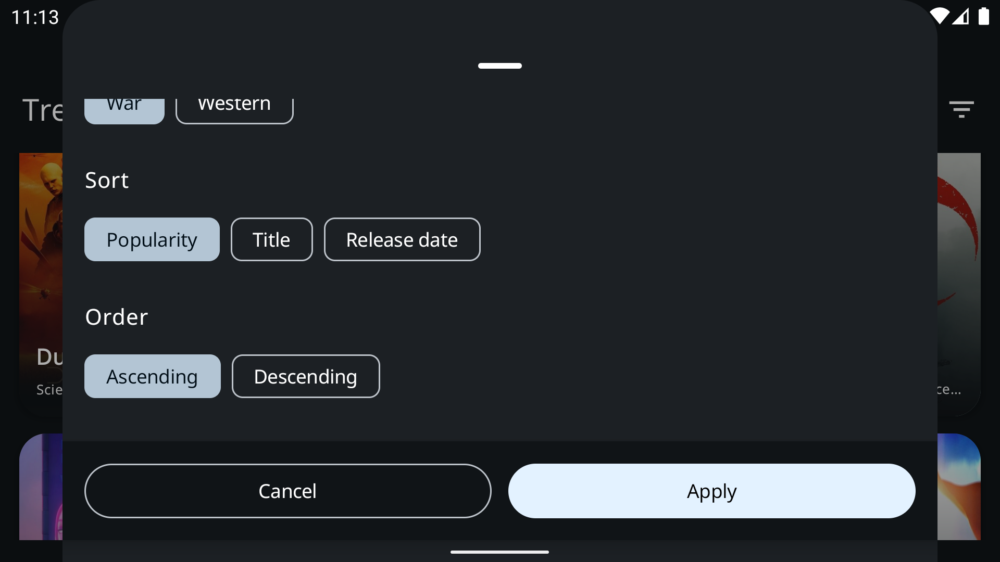
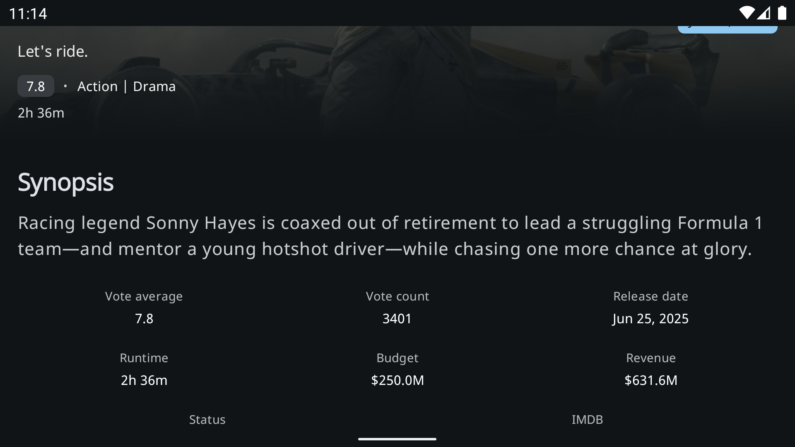
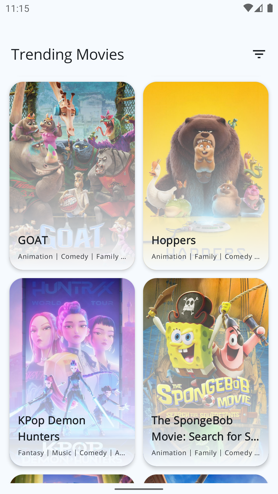
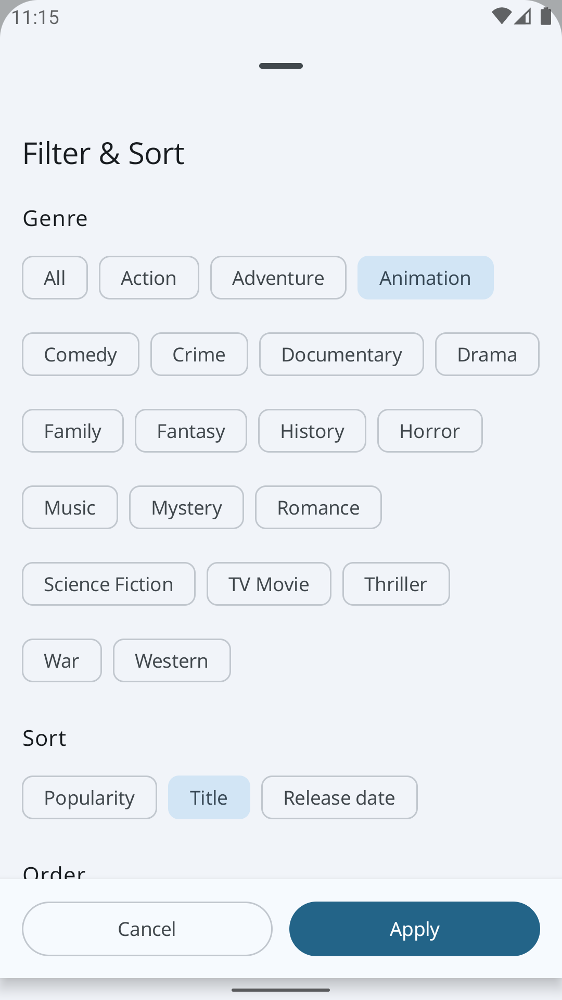
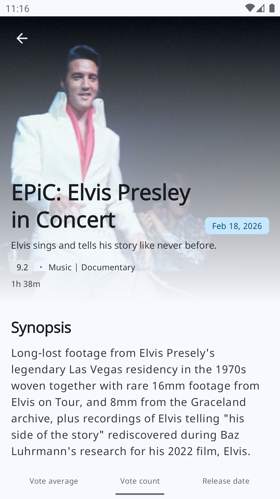

# TMDB — Project handover

## What this project is

This is an **Android application** that uses **The Movie Database (TMDB) API** to show trending movies. It was built as an assignment for an interview process.

**Main flows:**

- **Splash** — Loads TMDB configuration (image base URLs, etc.), persists it via DataStore, then navigates to the movie list (or quits if something goes wrong).
- **Movie list** — Displays trending movies in a grid. Users can filter by genre and sort by title or release date (asc/desc) via a bottom sheet. List supports loading, error, no-network, and empty states.
- **Movie detail** — Tapping a movie opens its detail screen (title, poster, overview, etc.).

The app is **single-Activity**, with Compose-based UI and a single navigation graph (Splash → Movie list → Movie detail).

---

## Tech stack and libraries

| Area | Technology |
|------|------------|
| **Language** | Kotlin |
| **UI** | Jetpack Compose, Material 3 |
| **Navigation** | Androidx Navigation Compose |
| **DI** | Koin (Android + Compose) |
| **Networking** | Retrofit 3, OkHttp 5, Kotlinx Serialization (JSON) |
| **Images** | Coil (Compose) |
| **Local storage** | Room (trending movies cache), DataStore Preferences (configuration), Security Crypto (DataStore) |
| **Architecture** | MVI-style (Intent → Reducer → State + Effects), ViewModel, StateFlow/SharedFlow |
| **Testing** | JUnit, Kotlinx Coroutines Test, Espresso, Compose UI Test (JUnit4) |

**Gradle:** Kotlin DSL, version catalog in `gradle/libs.versions.toml`. AGP 9.x, Compose BOM, `minSdk 27`, `targetSdk 36`.

---

## Project structure (modules)

- **`app`** — Application entry point, `MainActivity`, `AppNavigation`, Koin setup, and network/Retrofit configuration (API key interceptor, base URL).
- **`core:common`** — Shared base: `BaseViewModel` (MVI), `Reducer` interface, `CallState` (Loading/Success/Error/NoNetwork/NoResults), and common dependencies (e.g. Koin, Lifecycle).
- **`core:design`** — Theme (Material 3, typography, colors), shared Composables (e.g. error/empty states), and design tokens. Also exposes Coil and Compose BOM to features.
- **`data:configuration`** — TMDB configuration API, DataStore-backed configuration store, repository. Used by splash to load and persist image base URL etc.
- **`data:genres`** — TMDB genres API and repository. Used by the movie list for filter chips.
- **`data:movies`** — TMDB movies API (trending, movie detail), Room DB for caching trending movies, repository. Sorting/filtering is applied on the cached data.
- **`feature:splash`** — Splash screen and “load configuration then navigate or quit” flow.
- **`feature:movielist`** — Movie list screen, filter/sort bottom sheet, and list/grid UI.
- **`feature:moviedetail`** — Movie detail screen and its ViewModel/use case.

Features depend on `core:design` and `core:common`; they get data from the `data:*` modules. Navigation and effect handling (e.g. “navigate to detail”) live in `app` and are driven by ViewModel effects.

---

## Main design and implementation choices

### MVI and effects

- **Intents** represent user or system actions; **state** is a single data class per screen; **effects** are one-off events (e.g. “navigate to movie detail”, “load movies”).
- Each feature has a **Reducer** that takes `(State, Intent)` and returns `(State, Effect?)`. The **BaseViewModel** holds state in a `StateFlow`, runs the reducer on `sendIntent()`, and exposes effects via **SharedFlow**. This is so the same effect can be emitted multiple times (e.g. retries) and every emission is received; see the comments in `BaseViewModel` for the rationale vs `Channel.CONFLATED`.

### Configuration and splash

- TMDB image URLs require a “configuration” payload (base URL, sizes). The app fetches this on **splash**, maps it to a simple model, and stores it in **DataStore**. The rest of the app uses this stored configuration for building image URLs (e.g. with Coil). If configuration fails, the app can quit or show an error depending on the current logic.

### Caching (Room)

- **Trending movies** are fetched from the API and stored in **Room**. The movie list applies **sort** (e.g. by title or release date) and **genre filter** on top of this cached set. This keeps the UI responsive and allows offline-style behavior for the list once data is loaded. Cache metadata (e.g. last fetch time) can be used to decide when to refetch.

### API key and networking

- The TMDB **Read Access Token** is applied in an **OkHttp interceptor** (Authorization header). The code mentions moving this to `BuildConfig` or a secure store (e.g. env in CI) for production; the current placeholder is in `app`’s `NetworkModule`. Base URL: `https://api.themoviedb.org/3/`.

### UI and state

- **Compose** is used for all screens. List scroll position is preserved across navigation (e.g. back from detail) via a `LazyGridState` saved with `rememberSaveable` and a custom `Saver` in the app module. Error and empty states are centralized in `core:design` and reused from the movie list.

### Dependency injection

- **Koin** is used for all modules. ViewModels are created with `koinViewModel()` in Composables. Data modules provide repositories and data sources; feature modules provide ViewModels and use cases; the app module wires network and navigation.

---

## What you might want to do next

- **Secrets:** Move the API key out of source (e.g. `BuildConfig`, local.properties, or CI secrets) and document how to add it for local runs.
- **Tests:** Add more unit tests for reducers and use cases, and UI tests for critical flows (splash → list, filter/sort, list → detail).
- **Offline/errors:** Refine behavior when configuration or movies fail (retry, cache expiry, user messaging).
- **Accessibility:** Review content descriptions and focus order, especially in the list and filter/sort UI.

---

## How to run

1. Open the project in Android Studio (or use the command line with the project’s Gradle wrapper).
2. Ensure you have a valid **TMDB API Read Access Token**. If the placeholder in `app`’s network module is not set, add your token (see comment in `NetworkModule.kt`).
3. Build and run on an emulator or device (e.g. `./gradlew installDebug`).

---

## Screenshots

Below are thumbnails of the app screens. Click any image to open it at full size.

  
  
  
  
  

  
  
  
  
  

